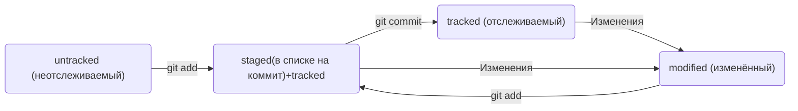

# Знакомство с GIT и базовыми командами в консоли

## **Что такое Git**
IT-команды не используют скетчбуки. Историю их проектов хранит отдельная программа — система контроля версий (англ. Version Control System, или коротко VCS).
Система контроля версий, или VCS, — это программное обеспечение, которое помогает отслеживать изменения в программах, текстовых файлах, больших документах, веб-сайтах и так далее. 
Одно изменение или группу изменений в VCS называют ревизией или версией.
 
Одна из ключевых особенностей современных систем контроля версий — поддержка параллельной работы нескольких пользователей, в том числе над одним файлом. 
Именно поэтому VCS так популярны у IT-команд.

### **Основные функции системы контроля версий:**
- хранит историю изменений в виде отдельных ревизий;
- позволяет манипулировать историей: например, менять порядок ревизий, полностью удалять версии, возвращаться назад в истории;
- помогает анализировать изменения: например, кто и когда вносит изменения, кто чаще всего вносит изменения в определённый файл и так далее.

**Git —** один из примеров системы контроля версий: он позволяет хранить, изменять и анализировать историю проекта.
**Git —** незаменимый в команде инструмент, ведь он помогает объединять результаты работы нескольких человек.

## Установка командной строки для пользователей Windows
---
Есть несколько способов установки. Мы рекомендуем пакет **Git for Windows**. Он установит не только Bash, но и сам Git, который всё равно понадобится вам дальше. 
**Вот что нужно сделать:**
1. Перейдите [на эту страницу официального сайта Git](https://git-scm.com/install/windows).
2. Скачайте одну из двух версий из категории **Standalone Installer** (англ. «автономный установщик»). Узнать тип вашей системы Windows можно в настройках. (Пуск → Параметры → Система → О программе. Раздел Тип системы.)
3. Запустите программу установки. Обратите внимание, куда будет установлен Git. Обычно это директория <kbd>C:\Program Files\Git</kbd>.
4. Проверьте, что в списке устанавливаемых программ стоит галочка напротив пункта **Git Bash Here** — это позволит открывать консоль с Git в любой папке. 
5. Далее установщик предложит много опций. Для нашего курса достаточно оставить все настройки по умолчанию. Несколько раз нажмите **Next** (англ. «далее»), пока не начнётся процесс установки.
6. После окончания установки нажмите **Finish** (англ. «завершить»).

## Первый запуск Git Bash
---
Запустите программу Git Bash. Сделать это можно двумя способами. Можно ввести название программы в окно поиска на панели задач.

А можно открыть директорию, в которую был установлен Git. Обычно это директория <kbd>C:\Program Files\Git\bin</kbd>. Перейдите в <kbd>bin</kbd> и запустите файл <kbd>bash.exe</kbd>.
Откроется консоль, в которой будет написано что-то похожее.
```
USER_NAME@HOST_NAME MINGW64 ~
```
Вместо <kbd>USER_NAME</kbd> будет указано ваше имя пользователя, а вместо <kbd>HOST_NAME</kbd> — имя компьютера.

## Командная строка и Git
---
Если вы пользователь macOS или Linux, запустите программу **Terminal**. Её можно найти через окно поиска операционной системы. 
А можно использовать комбинацию горячих клавиш:
для Linux — <kbd>Ctrl+Alt+T</kbd>;
для macOS — <kbd>Cmd+Space</kbd>, затем ввести <kbd>terminal</kbd>.

В открывшемся окне вы увидите:
- имя вашего компьютера;
- имя, под которым вы авторизовались в компьютере;
- символ доллара (<kbd>$</kbd>) — он означает, что программа ждёт ваших команд.

Так это будет выглядеть в Windows и Linux
```
userName@ComputerName ~
```

А так - в macOS
```
computerName:~ userName$
```

## Как не потеряться
---
В командной строке вы тоже всегда находитесь в какой-то папке — просто этого не видно. 
Узнать, где вы сейчас, поможет команда <kbd>pwd</kbd> (от англ. **p**rint **w**orking **d**irectory — «показать рабочую папку»). 
Она выводит путь к текущей директории (Директория и папка — это одно и то же).
```
$ pwd
/c/Users/%USERNAME%
/Users/%USERNAME% 
```

Командная строка выведет путь к папке, в которой вы сейчас находитесь. 
Вместо <kbd>%USERNAME%</kbd> будет ваше имя пользователя. Это путь к **домашней директории** (англ. *home directory*) — каталогу с файлами пользователя.
Когда вы открываете командную строку, вы оказываетесь именно в домашней директории.

С помощью терминала вы всегда можете перейти к домашней директории. 
Для этого нужно ввести команду <kbd>cd</kbd> (от англ. **c**hange **d**irectory — «сменить директорию») и символ <kbd>~</kbd> — обозначение домашней директории. Не забудьте про <kbd>Enter</kbd> для выполнения.
```
$ cd ~
```

Домашняя директория может быть разной для разных пользователей одного и того же компьютера. 

## Вывести содержимое директории — <kbd>ls</kbd>
Когда вы открываете папку через графический интерфейс операционной системы, вы сразу видите её содержимое. 
В случае с консолью для отображения файлов и папок используют команду — <kbd>ls</kbd> (от англ. **l**i**s**t directory contents — «отобразить содержимое директории»).

## Дополнительные возможности <kbd>ls</kbd>

У многих команд консоли есть дополнительные опции. 
Например, если вы вызовете <kbd>ls</kbd>, то увидите список обычных файлов в директории. Но можно вызвать <kbd>ls</kbd> с флагом <kbd>-a</kbd> и вывести расширенный список. 
В нём отобразятся все скрытые файлы, которые начинаются с символа <kbd>.</kbd> (например, файлы конфигурации). 
В том числе два особых файла <kbd>.</kbd> и <kbd>..</kbd>, которые обозначают текущую и родительскую директории.
```
$ ls # вывели список файлов
file.txt
photo.png

$ ls -a # вывели список, в котором отображаются скрытые файлы ., .. и .git
.
..
.git
file.txt
photo.png 
```

## Сменить директорию — <kbd>cd</kbd>
Следующая важная команда — <kbd>cd</kbd> (от англ. **c**hange **d**irectory — «сменить директорию»). 
Она меняет текущую рабочую директорию на ту, которая указана в качестве параметра (Параметр показывает, над чем выполняется команда.): <kbd>cd имя_папки</kbd>.

Допустим, вы находитесь в директории <kbd>/projects</kbd>. Если ввести команду <kbd>cd github</kbd>, она перенесёт вас в директорию <kbd>/projects/github</kbd>. 
```
$ pwd
/projects # сейчас мы здесь

$ cd github # переходим в папку github

$ pwd
/projects/github # теперь мы здесь!  
```

Обратите внимание: если в названии папки есть пробелы, при вводе нужно использовать кавычки.
```
$ cd "Фотографии с дня рождения" 
```

Чтобы вернуться в родительскую директорию — то есть на уровень выше, — вместо названия папки нужно написать две точки: <kbd>..</kbd>.
```
$ pwd
/projects/github # сейчас мы здесь

$ cd .. # переходим на уровень выше

$ pwd
/projects # мы вернулись! 
```

Есть ещё одна команда с точкой. Чтобы обратиться к текущей директории, можно использовать <kbd>.</kbd>. 
Но это нужно довольно редко — например, для запуска скриптов (Скрипт — небольшая программа для выполнения конкретной задачи.) и программ, которые принимают папку в качестве параметра. 
```
$ pwd
/projects/github # сейчас мы здесь

$ cd . # переходим в текущую директорию

$ pwd
/projects/github # ничего не поменялось  
```

Также <kbd>cd</kbd> позволяет перемещаться сразу через несколько директорий. Для этого нужно разделить их названия знаком <kbd>/</kbd>.
```
$ pwd
/projects # сейчас мы здесь

$ cd github/open-source-project # переходим через несколько директорий

$ pwd
/projects/github/open-source-project # переместились сразу в папку open-source-project внутри github 
```

В домашнюю директорию можно попасть так же быстро. Символ «тильда» (<kbd>~</kbd>) по умолчанию хранит ссылку на домашнюю директорию. 
Поэтому, чтобы переместиться в неё, достаточно напечатать <kbd>~</kbd> и нажать <kbd>Enter</kbd>.
```
$ cd ~
$ pwd 
/Users/Username

$ cd ~/Documents # папка Documents хранится в домашней директории
$ pwd
/Users/Username/Documents 
```

## Создание файлов и директорий — <kbd>touch</kbd>, <kbd>mkdir</kbd>

Чтобы создать файл, нужно ввести в консоль команду <kbd>touch</kbd> (англ. «коснуться») с именем файла в качестве параметра: <kbd>touch %ИМЯ_ФАЙЛА%</kbd>.
```
$ touch my-new-file.txt # создали файл my-new-file.txt 
```

Хорошей практикой при создании файла считается указывать его расширение (в примере — <kbd>.txt</kbd>). Это позволит операционной системе выбрать подходящую программу, чтобы открыть файл.
Это позволит операционной системе выбрать подходящую программу, чтобы открыть файл. А ещё поможет другому человеку понять, какое содержимое находится внутри. 

Для создания директорий через терминал используют другую команду — <kbd>mkdir</kbd> (от англ. **m**a**k**e **dir**ectory — «создать директорию»). 
```
$ mkdir new-dir # создали директорию new-dir 
```

Можно создать целую структуру директорий одной командой с помощью флага <kbd>-p</kbd>.
```
$ mkdir -p dir1/dir-inside/dir-deeper-inside
# создали папку dir-deeper-inside в папке dir-inside, которая находится в папке dir1 
```

Также можно использовать обе команды вместе с символом домашней директории (<kbd>~</kbd>) или родительской директории (<kbd>..</kbd>). 
Например, команда <kbd>mkdir ~/my-git-projects</kbd> создаст папку <kbd>my-git-projects</kbd> внутри домашней директории.

А команда <kbd>touch ../../file.txt</kbd> создаст файл <kbd>file.txt</kbd> на две папки выше по иерархии. 
Допустим, если вы находитесь в директории <kbd>projects/git/hello</kbd>, команда <kbd>touch ../../file.txt</kbd> создаст файл по такому пути: <kbd>projects/file.txt</kbd>.

## Копирование файлов — <kbd>cp</kbd>

Для копирования файлов через терминал существует команда <kbd>cp</kbd> (от англ. copy — «копировать»).
В простом виде <kbd>cp</kbd> принимает два параметра: <kbd>что копируем</kbd> и <kbd>куда копируем</kbd>.
```
$ cp что_копируем куда_копируем

$ cp index.html src/
# скопировали index.html в папку src 
```

Но можно указать сразу несколько файлов.
```
$ cp что_копируем что_копируем что_копируем куда_копируем

$ cp index.html style.css script.js src/
# скопировали три файла (index.html, style.css и script.js) в папку src 
```

## Перемещение файлов и папок — <kbd>mv</kbd>
Синтаксис команды <kbd>mv</kbd> аналогичен синтаксису <kbd>cp</kbd>. После имени команды указывают список файлов и папок, которые нужно переместить, а затем — папку, в которую нужно выполнить перемещение.
```
$ mv table.csv ./very-important-files
# сначала указываем имя файла, который хотим переместить, потом путь — куда перемещаем 
```

## Чтение файлов — <kbd>cat</kbd>

Чтобы прочитать файл, в консоль нужно ввести <kbd>cat</kbd> (от англ. con**cat**enate and print — «объединить и распечатать») вместе с именем файла. 
Команда распечатает то, что содержится в нём. 
```
$ cat myfile.txt # распечатали содержимое файла myfile.txt
file-content-1
file-content-2
```
 
Команда <kbd>cat</kbd> работает только с текстовыми файлами. 
Вывести этой командой файл другого типа (например, изображение) не получится.

## Удаление файлов и папок — <kbd>rm</kbd>, <kbd>rmdir</kbd>, <kbd>rm -r</kbd>

Чтобы удалить файл, нужно напечатать команду <kbd>rm</kbd> (от англ. **r**e**m**ove — «удалить») и передать ей имя файла.
```
$ rm example.txt # удалили файл example.txt из текущей папки
```

Удалить папку можно командой <kbd>rmdir</kbd> (от англ. **r**e**m**ove **dir**ectory — «удалить директорию»). Не забудьте указать имя папки.
```
$ rmdir images # команда удалит папку images из текущей директории, 
               # если папка images пуста 
```

Если в папке, которую вы пытаетесь стереть, есть какие-то файлы, то командная строка не удалит её и выведет сообщение о том, что папка не пуста (англ. <kbd>Directory not empty</kbd>).

Если папку всё-таки нужно удалить вместе со всем её содержимым, можно использовать команду <kbd>rm</kbd> так.
```
$ rm -r images # удалили папку images со всем её содержимым из текущей директории 
```

В этом случае команда <kbd>rm -r</kbd> (*-r* — от англ. **r**ecursive, **«рекурсивный»**) рекурсивно** удаляет файлы и папки. 
Это значит, что удаление будет последовательно применяться к каждому из элементов в этой папке — пока не сотрёт их все. 
Затем команда удалит пустую директорию.

## Выполняйте сразу несколько команд

Команды в терминале необязательно вбивать и выполнять по очереди. 
Их можно указывать не по одной, а сразу списком. Для этого их нужно разделить двумя амперсандами (<kbd>&&</kbd>).
```
$ mkdir second-project && cd second-project && touch index.html style.css
# создаём папку second-project,
# переходим в папку second-project
# и создаём в ней два файла: index.html и style.css 
```

## Вызывайте команды из буфера

Чтобы обратиться к последней введённой команде, нажмите на клавиатуре стрелку вверх (<kbd>↑</kbd>).
Чтобы вернуться — например, от предпоследней команды к последней, — нажмите стрелку вниз (<kbd>↓</kbd>).

## Используйте автозаполнение

Если нужно найти какую-нибудь из них, достаточно вспомнить, с каких букв она начинается. 
Можно набрать их в командной строке и дважды нажать клавишу <kbd>Tab</kbd>. 
Терминал заполнит имя автоматически.
Если этого не происходит, значит, есть несколько файлов или папок, которые начинаются так же. 
Нажмите <kbd>Tab</kbd> ещё раз, и вы увидите их список.

---

# Шпаргалка. Базовые команды в консоли

## Навигация

- <kbd>pwd</kbd> (от англ. print working directory, «показать рабочую папку») — покажи, в какой я папке;
- <kbd>ls</kbd> (от англ. list directory contents, «отобразить содержимое директории») — покажи файлы и папки в текущей папке;
- <kbd>ls -a</kbd> — покажи также скрытые файлы и папки, названия которых начинаются с символа <kbd>.</kbd>;
- <kbd>cd first-project</kbd> (от англ. change directory, «сменить директорию») — перейди в папку <kbd>first-project</kbd>;
- <kbd>cd first-project/html</kbd> — перейди в папку <kbd>html</kbd>, которая находится в папке <kbd>first-project</kbd>;
- <kbd>cd ..</kbd> — перейди на уровень выше, в родительскую папку;
- <kbd>cd ~</kbd> — перейди в домашнюю директорию (<kbd>/Users/Username</kbd>);
- <kbd>cd /</kbd> — перейди в корневую директорию.

## Работа с файлами и папками

### Создание

- <kbd>touch index.html</kbd> (англ. touch, «коснуться») — создай файл <kbd>index.html</kbd> в текущей папке;
- <kbd>touch index.html style.css script.js</kbd> — если нужно создать сразу несколько файлов, можно напечатать их имена в одну строку через пробел;
- <kbd>mkdir second-project</kbd> (от англ. make directory, «создать директорию») — создай папку с именем <kbd>second-project</kbd> в текущей папке.

##Копирование и перемещение

- <kbd>cp file.txt ~/my-dir</kbd> (от англ. copy, «копировать») — скопируй файл в другое место;
- <kbd>mv file.txt ~/my-dir</kbd> (от англ. move, «переместить») — перемести файл или папку в другое место.

## Чтение

- <kbd>cat file.txt</kbd> (от англ. concatenate and print, «объединить и распечатать») — распечатай содержимое текстового файла <kbd>file.txt</kbd>.

## Удаление

- <kbd>rm about.html</kbd> (от англ. remove, «удалить») — удали файл <kbd>about.html</kbd>;
- <kbd>rmdir images</kbd> (от англ. remove directory, «удалить директорию») — удали папку <kbd>images</kbd>;
- <kbd>rm -r second-project</kbd> (от англ. remove, «удалить» + recursive, «рекурсивный») — удали папку <kbd>second-project</kbd> и всё, что она содержит.

## Полезные возможности

Команды необязательно печатать и выполнять по очереди. Можно указать их списком — разделить двумя амперсандами (<kbd>&&</kbd>).
У консоли есть собственная память — буфер с несколькими последними командами. По ним можно перемещаться с помощью клавиш со стрелками вверх (<kbd>↑</kbd>) и вниз (<kbd>↓</kbd>).
Чтобы не вводить название файла или папки полностью, можно набрать первые символы имени и дважды нажать <kbd>Tab</kbd>. 
Если файл или папка есть в текущей директории, командная строка допишет путь сама.

Например, вы находитесь в папке <kbd>dev</kbd>. Начните вводить <kbd>cd first</kbd> и дважды нажмите </kbd>Tab</kbd>. 
Если папка <kbd>first-project</kbd> есть внутри <kbd>dev</kbd>, командная строка автоматически подставит её имя. Останется только нажать <kbd>Enter</kbd>.

# Установка Git

## Windows
Если вы пользователь Windows, то Git у вас уже есть. Вы установили его в составе пакета Git for Windows вместе с командной строкой.
Убедитесь в этом. Откройте консоль и выполните эту команду.
```
$ git version 
```
Если Git установлен правильно, консоль выведет его текущую версию. 

## macOS
Для установки Git на macOS существует два способа.
Первый способ. Откройте консоль и выполните команду <kbd>/usr/bin/git</kbd>. Она запустит установщик. Нажмите **Install** (англ. «установить») и дождитесь окончания установки. 
Когда установка завершится, для проверки выполните эту команду.
```
$ git version 
```
Если на экран выводится текущая версия Git, значит, установка прошла успешно.

## Второй способ. Используйте Homebrew.
1. Установите менеджер пакетов Homebrew:
 a. Перейдите [на официальный сайт](https://brew.sh/) Homebrew.
 b. Скопируйте команду для установки — справа от неё есть символ для копирования. Нажмите на него, чтобы команда попала в буфер обмена.
 c. Найдите программу Terminal в поиске Spotlight или в списке программ. Вставьте скопированный текст в окно терминала и нажмите <kbd>Enter</kbd>.
2. Установите Git с помощью Homebrew. Скопируйте и введите в терминал следующую команду:
```
$ brew install git 
```
3. Проверьте установку. Для этого откройте терминал и введите эту команду:
```
$ git version 
```
Если на экран выводится текущая версия Git, значит, установка прошла успешно.

## Linux

Для установки Git на Linux нужно использовать терминал. Найдите программу Terminal в поиске или в списке программ. 
Перейдите [на официальный сайт Git](https://git-scm.com/install/linux) и выберите команду установки для своей версии Linux. Скопируйте её в программу Terminal и нажмите <kbd>Enter</kbd>.
После успешной установки введите команду для проверки:
```
$ git version 
```
Если вы видите в консоли текущую версию Git, всё прошло успешно.

# Настройка Git

## Работа с файлом настройки <kbd>.gitconfig</kbd>

Чтобы участникам проекта было понятно, кто и какие изменения вносил, нужно представиться и указать имя пользователя и адрес электронной почты.
Вы можете указать любую электронную почту и любое имя. Сделать это можно с помощью команды <kbd>git config</kbd> (от англ. *configuration* — «конфигурация», «настройка») с ключом <kbd>--global</kbd> (англ. «глобальный»). 
При этом не имеет значения, в какой директории вы находитесь прямо сейчас: вызов <kbd>git config --global</kbd> сработает везде.
В качестве значения <kbd>user.name</kbd> нужно указать своё имя или никнейм. Для настройки параметра <kbd>user.email</kbd> указывают электронную почту.
```
$ git config --global user.name "User Namovich" 
# имя или ник нужно написать латиницей и в кавычках

$ git config --global user.email username@yandex.ru
# здесь нужно указать свой настоящий email 
```
Все глобальные настройки Git хранит в файле <kbd>.gitconfig</kbd> в домашней директории. Команда запишет в этот файл указанные имя и почту. 
Чтобы убедиться в этом, можно вызвать команду для чтения файлов.
```
$ cat ~/.gitconfig 
```
Другой способ проверки — вывести содержимое файла конфигурации Git той же командой <kbd>git config</kbd> с флагом <kbd>--list</kbd> (англ. **«список»).
```
$ git config --list 
```
В ответ командная строка покажет текущие значения настроек.
```
user.name=Username
user.email=username@yandex.ru 
```

# Работа с Git
---
# Инициализируем репозиторий

## Сделать папку репозиторием — <kbd>git init</kbd>
Чтобы Git начал отслеживать изменения в проекте, папку с файлами этого проекта нужно сделать Git-репозиторием (от англ. *repository* — «хранилище»). 
Для этого следует переместиться в неё и ввести команду <kbd>git init</kbd> (от англ. **init**ialize — «инициализировать»).
Например, создайте папку <kbd>first-project</kbd> и сделайте её Git-репозиторием: перейдите в неё с помощью команды <kbd>cd</kbd> и выполните <kbd>git init</kbd>.
```
$ cd ~/dev/first-project # перешли в нужную папку

$ git init # создали репозиторий 
```
Вы можете создать папку в любом месте на компьютере. Но в этом случае не забывайте менять в наших примерах путь <kbd> ~/dev/first-project</kbd>  на тот, который ведёт к вашей папке. 
Помните, что не рекомендуется создавать репозиторий Git внутри другого Git-репозитория. Это может вызывать проблемы с отслеживанием изменений.
Также <kbd>git init</kbd> выведет сообщение вида <kbd>Initialized empty Git repository in <*ваша папка с проектом*>/.git/</kbd> (англ. «инициализирован пустой Git-репозиторий в <kbd><*ваша папка*>/.git/</kbd>»). В подпапке <kbd>.git</kbd> Git будет хранить всю служебную информацию.
Команда <kbd>git init</kbd> — одна из редко применяемых, ведь репозиторий создаётся один раз, а пользоваться им можно сколько угодно долго.

## «Разгитить» папку, если что-то пошло не так, <kbd>— rm -rf .git</kbd>
Если вы случайно сделали Git-репозиторием не ту папку, её можно «разгитить». Для этого нужно удалить скрытую подпапку <kbd>.git</kbd>.
```
$ cd <папка с репозиторием> # перешли в папку

$ rm -rf .git # удалили подпапку .git 
```
Разберём подробнее, что такое <kbd>-rf</kbd>:
ключ <kbd>-r</kbd> (от англ. **r**ecursive — «рекурсивно») позволяет удалять папки вместе с их содержимым;
ключ <kbd>-f</kbd> (от англ. **f**orce — «заставить») избавит вас от вопросов вроде «Вы точно хотите удалить этот файл? А этот? И этот тоже?».
Будьте осторожны: в подпапке <kbd>.git</kbd> хранится история изменений. Если удалить <kbd>.git</kbd>, то вся история проекта будет стёрта без возможности восстановления — останется только последняя версия файлов.

## Проверить состояние репозитория — <kbd>git status</kbd>
После инициализации репозитория <kbd>first-project</kbd> запустите команду git status (от англ. *status* — «статус», «состояние») — она показывает текущее состояние репозитория. 
Команда <kbd>git status</kbd> выведет:
- название текущей ветки: <kbd>On branch master</kbd> или <kbd>On branch main</kbd>;
- сообщение о том, что в репозитории ещё нет коммитов: <kbd>No commits yet</kbd>;
- сообщение, которое говорит: «чтобы что-нибудь закоммитить (то есть зафиксировать), нужно сначала это создать» — <kbd>nothing to commit (create/copy files and use "git add" to track)</kbd>.

В отличие от git init, команду git status используют часто. В любой непонятной ситуации стоит посмотреть состояние (статус) репозитория, а потом решить, что делать дальше.

# Добавляем файлы в репозиторий

## Подготовить файлы к сохранению — <kbd>git add</kbd>

Мы хотим отслеживать состояние файлов, поэтому можем использовать команду <kbd>git add --all</kbd> (от англ. *add* — «добавить» + от англ. *all* — **«всё»). 
Ключ, или флаг, <kbd>--all</kbd> позволяет подготовить к сохранению все файлы в репозитории.
```
$ git add --all # подготовили к сохранению все файлы в репозитории
$ git status # проверили статус 
```
Добавлять файлы можно и по одному, без ключа <kbd>--all</kbd>.
```
$ git add todo.txt
$ git add readme.txt
$ git status 
```
Также можно добавить текущую папку целиком — в этом случае все файлы в ней тоже будут добавлены. Обратиться к текущей папке в Bash позволяет точка (<kbd>.</kbd>).
```
$ git add . # добавить всю текущую папку
$ git status 
```

# Делаем первый коммит
Коммит — это одна из основных сущностей в Git (и в других системах контроля версий). 
Коммит гарантирует, что изменения будут сохранены в истории и при необходимости к ним можно будет «откатиться». Это как если бы вы могли выполнить операцию <kbd>Ctrl+Z</kbd> для целой папки (репозитория).

## Выполнить коммит — <kbd>git commit</kbd>
Сделать коммит можно командой <kbd>git commit</kbd> c ключом <kbd>-m</kbd> (от англ. **m**essage — «сообщение»), который присваивает коммиту сообщение.
Обычно в таком сообщении поясняется, в чём именно состояли изменения.
```
$ git commit -m ‘Мой первый коммит!’ 
```
После нажатия <kbd>Enter</kbd> текущая версия файлов будет сохранена в репозитории с сообщением <kbd>Мой первый коммит!</kbd>. **Коммит** (по названию команды <kbd>git commit</kbd>) — это по сути список файлов с их контентом. 

Команда <kbd>git commit</kbd> выведет информацию о коммите.
- <kbd>[master (root-commit) baa3b6e]</kbd> значит:
	- коммит был в ветке <kbd>master</kbd>;
	- <kbd>root-commit</kbd> — это самый первый, или «корневой» (англ. *root*), коммит в ветке, у следующих коммитов такой надписи не будет;
	- <kbd>baa3b6e</kbd> — сокращённый идентификатор коммита.
- <kbd>2 files changed, 1 insertion(+)</kbd> значит:
	- изменились два файла (<kbd>readme.txt</kbd> и <kbd>todo.txt</kbd>);
	- одна строка была добавлена (<kbd>1. Пройти пару уроков по Git.</kbd>)
- Строки вида <kbd>create mode 100644 readme.txt</kbd> — это более подробная информация о новых (добавленных в Git) файлах.
	- <kbd>create</kbd> (англ. «создать») говорит, что файл был создан. Если бы файл был удалён, на этом месте было бы слово <kbd>delete</kbd> (англ. «удалить»).
	- <kbd>mode 100644</kbd> сообщает, что это обычный файл. Также возможны варианты <kbd>100755</kbd> для исполняемых файлов (например, что-нибудь.exe) и <kbd>120000</kbd> для файлов-ссылок в Linux. Файлы-ссылки не содержат данных сами по себе, а только ссылаются на другие файлы — как «ярлыки» в Windows.

# Просматриваем историю коммитов

## Просмотреть историю коммитов — <kbd>git log</kbd>
Чтобы увидеть все коммиты, введите команду git log (от англ. *log* — «журнал [записей]»).
По умолчанию <kbd>git log</kbd> выводит коммиты в обратном хронологическом порядке — последние коммиты оказываются первыми сверху. В этом можно убедиться, если посмотреть на дату и время их создания.

# Создаём удалённый репозиторий

## Инструкция по созданию репозитория на GitHub

1. Зайдите в свой профиль по ссылке <kbd>https://github.com/username</kbd>, где <kbd>username</kbd> — имя, которое вы указали при регистрации.
2. Создайте репозиторий. Для этого перейдите на вкладку **Repositories** (англ. «репозитории»), а затем нажмите на зелёную кнопку **New** (англ. «новый») справа.
3. Открылось окно создания нового репозитория. Название удалённого репозитория необязательно должно совпадать с именем папки проекта у вас на компьютере. Но чтобы не путаться, будем называть их одинаково.

Другие поля вам пока не понадобятся. Смело нажимайте на зелёную кнопку **Create repository** (англ. «создать репозиторий») внизу.
Осталось связать удалённый репозиторий с локальным, который уже есть на вашем компьютере. GitHub предоставляет для этого инструкцию (Под инструкцией в программировании понимают набор команд) (пункт <kbd>…or push an existing repository from the command line</kbd>).

# Что такое SSH. Генерируем SSH-ключ
Когда компьютеры обмениваются данными в сети, они следуют **сетевым протоколам** (англ. *network protocols*) — правилам обмена данными между компьютерами.
Один из наиболее распространённых сетевых протоколов — **SSH** (от англ. **S**ecure **Sh**ell Protocol). Он обеспечивает безопасный обмен данными в сети. С помощью этого протокола можно получать данные с удалённого компьютера или отправлять их на него. Трафик шифруется, поэтому протокол безопасен.
SSH использует пару ключей для обеспечения безопасности — публичный и приватный: 
- **Приватный ключ** (англ. private key) хранится только на вашем компьютере и не должен передаваться кому-либо ещё. Он используется для расшифровки данных.
- **Публичный ключ** (англ. public key) доступен всем и используется для шифрования данных. Они могут быть расшифрованы парным приватным ключом.
Только вы можете расшифровать данные с помощью приватного ключа, но любой владелец публичного ключа может их для вас зашифровать. Эти два ключа связаны и образуют **SSH-пару**. В будущем вы наверняка будете использовать их для взаимодействия с GitHub и другими удалёнными серверами.

## Проверка наличия SSH-ключа
Прежде чем генерировать SSH-ключи, убедитесь, что у вас их ещё нет. По умолчанию директория с SSH-ключами находится в домашней директории пользователя.
```
$ cd ~ # перешли в домашнюю директорию 
```
Обычно SSH-ключи находятся в директории .ssh/. Проверить наличие этой директории и файлов в ней можно с помощью следующей команды.
```
$ ls -la .ssh/ # вывели список созданных ключей 
```
Если папка пустая или её нет, всё в порядке. 
Если есть файлы с похожими названиями, SSH-ключи уже создавались:
<kbd>id_dsa.pub</kbd>;
<kbd>id_ecdsa.pub</kbd>;
<kbd>id_ed25519.pub</kbd>;
<kbd>id_rsa.pub</kbd>.
Если вы не создавали эти файлы, удалите их все.

## Инструкция по генерации SSH-ключа
1. Для генерации SSH-пары можно использовать программу <kbd>ssh-keygen</kbd>. Откройте терминал и введите следующую команду.
```
$ ssh-keygen -t ed25519 -C "электронная почта, к которой привязан ваш аккаунт на GitHub"
```
Используйте электронную почту, к которой привязан ваш GitHub-аккаунт.
	Если вы видите сообщение об ошибке, то, скорее всего, ваша система не поддерживает алгоритм шифрования <kbd>ed25519</kbd>. Ничего страшного: используйте другой алгоритм.
```
$ ssh-keygen -t rsa -b 4096 -C "электронная почта, к которой привязан ваш аккаунт на GitHub" 
```
После ввода отобразится такое сообщение.
```
> Generating public/private rsa key pair. # сгенерированы публичный и приватный ключи 
```
2. Укажите место хранения ключей. Простой вариант — сделать домашний каталог пользователя путём по умолчанию. Для этого нажмите <kbd>Enter</kbd>.
### macOS
```
> Enter a file in which to save the key (/Users/you/.ssh/id_rsa): [Press enter] 
```
### Windows
```
> Enter a file in which to save the key (C:\Users\<имя_пользователя>\.ssh\):[Press enter] 
```
Теперь в указанной директории появится пара ключей.
3. Программа запросит **кодовую фразу** (англ. *passphrase*) для доступа к SSH-ключу. Вы можете оставить поле пустым. Для этого нажмите <kbd>Enter</kbd>, а затем ещё раз <kbd>Enter</kbd> для подтверждения.
```
> Enter passphrase (empty for no passphrase): [Type a passphrase]
> Enter same passphrase again: [Type passphrase again] 
```
4. Готово! Теперь осталось проверить, что ключи действительно сгенерировались. Для этого вызовите эту команду.
```
ls -a ~/.ssh 
```
На экране должны появиться два файла — один с расширением <kbd>.pub</kbd>, другой — без. Файл в <kbd>.pub</kbd> — публичный, им можно делиться с веб-сайтами или коллегами. Файл без расширения <kbd>.pub</kbd> — приватный. **Ни в коем случае не передавайте его никому!**

# Привязываем SSH-ключ к GitHub

## Инструкция по связыванию SSH-ключа и GitHub-аккаунта
1. После выполнения команды <kbd>ssh-keygen</kbd> из предыдущего урока в директории <kbd>~/.ssh</kbd> будет создано два файла — <kbd>id_ed25519</kbd> и <kbd>id_ed25519.pub</kbd> (или <kbd>id_rsa</kbd> и <kbd>id_rsa.pub</kbd> — в зависимости от того, какой алгоритм вы использовали):
- <kbd>id_ed25519/id_rsa</kbd> — приватный ключ (файл без <kbd>.pub</kbd> в конце). Ни в коем случае не копируйте его и не делитесь им.
- <kbd>id_ed25519.pub/id_rsa.pub</kbd> — публичный ключ (на это указывает расширение <kbd>.pub</kbd>).
Скопируйте содержимое файла с публичным ключом в буфер обмена.

### macOS
```
# скопировать содержимое ключа в буфер обмена:
$ pbcopy < ~/.ssh/id_rsa.pub
# для ed25519:
$ pbcopy < ~/.ssh/id_ed25519.pub 
```
Здесь используется команда <kbd>pbcopy</kbd> — она копирует поток данных в буфер обмена. Запись pbcopy <kbd>< ~/.ssh/id_rsa.pub</kbd> означает: «Скопируй в буфер обмена всё содержимое файла <kbd>~/.ssh/id_rsa.pub</kbd>».
В качестве альтернативы вы можете распечатать файл на экран с помощью <kbd>cat ~/.ssh/id_rsa.pub</kbd> и скопировать его вручную.

### Windows
```
# скопировать содержимое ключа в буфер обмена:
$ clip < ~/.ssh/id_rsa.pub
# для ed25519:
$ clip < ~/.ssh/id_ed25519.pub 
```
Если <kbd>clip</kbd> не сработает, выведите содержимое файла с помощью <kbd>cat ~/.ssh/id_rsa.pub</kbd> или <kbd>cat ~/.ssh/id_ed25519.pub</kbd> и скопируйте вывод в буфер обмена из консоли.

2. Перейдите на GitHub и выберите пункт **Settings** (англ. «настройки») в меню аккаунта.
3. В меню слева нажмите на пункт **SSH and GPG keys**.
4. В открывшейся вкладке выберите **New SSH key** (англ. «новый SSH-ключ»).
5. В поле **Title** (англ. «заголовок») напишите название ключа. Например, **Personal key** (англ. «личный ключ»).
6. В поле **Key type** (англ. «тип ключа») должно быть **Authentication Key** (англ. «ключ аутентификации»).
7. В поле **Key** скопируйте ваш ключ из буфера обмена.
8. Нажмите на кнопку **Add SSH key** (англ. «добавить SSH-ключ»).
9. Проверьте правильность ключа с помощью следующей команды.
```
$ ssh -T git@github.com 
```
Если это первый раз, когда вы используете Git, чтобы поделиться проектом на GitHub, появится похожее предупреждение.
```
The authenticity of host 'github.com (140.82.121.4)' can't be established. ED25519 key fingerprint is SHA256:+DiY3wvvV6TuJJhbpZisF/zLDA0zPMSvHdkr4UvCOqU. This key is not known by any other names. Are you sure you want to continue connecting (yes/no/[fingerprint])?
```
Это предупреждение сообщает, что вы никогда не соединялись с сервером GitHub. Поэтому Git не может гарантировать, что сервер является тем, за кого он себя выдаёт.
Для подтверждения подлинности сервер генерирует и публикует ключи SHA256. Вы можете проверить ключи GitHub [по этой ссылке](https://docs.github.com/en/authentication/keeping-your-account-and-data-secure/githubs-ssh-key-fingerprints). Если ключ в предупреждении совпадает с тем, что вы видите на сайте, значит, сервер является действительным. Введите <kbd>yes</kbd>, чтобы продолжить. Вы увидите приветствие на экране.
```
Hi %ВАШ_АККАУНТ%! You've successfully authenticated, but GitHub does not provide shell access.
```

# Связываем локальный и удалённый репозитории

## Привязать удалённый репозиторий к локальному — <kbd>git remote add</kbd>
Перейдите на страницу удалённого репозитория в GitHub, выберите тип SSH и скопируйте URL. 

Откройте консоль, перейдите в каталог локального репозитория и введите команду <kbd>git remote add</kbd> (от англ. *remote* — «удалённый» и *add* — «добавить»).
```
$ cd ~/dev/first-project
$ git remote add origin git@github.com:%ИМЯ_АККАУНТА%/first-project.git 
```
Команде необходимо передать два параметра: имя удалённого репозитория и его URL. В качестве имени используйте слово <kbd>origin</kbd>. А URL вы скопировали со страницы удалённого репозитория.

В командную строку нельзя вставить текст из буфера обмена с помощью привычного сочетания <kbd>Ctrl+V</kbd>. На Windows (в Git Bash) и Linux для этого используется сочетание <kbd>Ctrl+Shift+V</kbd>, а на macOS — <kbd>Cmd+V</kbd>.

<kbd>origin</kbd> (англ. «источник») — стандартный псевдоним, с помощью которого можно обращаться к главному удалённому репозиторию (обычно такой репозиторий один). Это значительно упрощает работу.

## Убедиться, что репозитории связаны, — <kbd>git remote -v</kbd>

Отлично: вы связали локальный репозиторий с удалённым. Осталось убедиться, что всё работает, с помощью следующей команды.
```
$ git remote -v
origin    git@github.com:%ИМЯ_АККАУНТА%/%ИМЯ-ПРОЕКТА%.git (fetch)
origin    git@github.com:%ИМЯ_АККАУНТА%/%ИМЯ-ПРОЕКТА%.git (push)
```
В выводе вы должны увидеть две строчки, аналогичные тем, что показаны выше.

Флаг <kbd>-v</kbd> — короткая форма флага <kbd>--verbose</kbd> (англ. «подробный»). Он позволяет показать больше информации в выводе.

# Синхронизируем локальный и удалённый репозитории

## Основная ветка
Мы упоминали, что каждый коммит сохраняет актуальное состояние файлов. Сами же коммиты хранятся в **ветках** (англ. *branch*).
Если коммит — это снимок состояния файлов, то ветка — временна́я шкала, на которой расположены эти снимки. Ветка всегда начинается от одного из коммитов.
В репозитории может существовать сразу несколько веток — параллельных историй изменений. Также они могут соединяться друг с другом.
Самая первая ветка в репозитории появляется автоматически и называется <kbd>main</kbd> (англ. «основная») или <kbd>master</kbd>. Её имя нужно указывать при отправке коммитов на удалённый репозиторий или при получении их из него.

## Отправить изменения на удалённый репозиторий — <kbd>git push</kbd>

В первый раз эту команду нужно вызвать с флагом <kbd>-u</kbd> и параметрами <kbd>origin</kbd> (имя удалённого репозитория) и <kbd>main</kbd> или <kbd>master</kbd> (название текущей ветки). 
Флаг <kbd>-u</kbd> свяжет локальную ветку с одноимённой удалённой. Как вы связывали локальный и удалённый репозитории в предыдущем уроке, так же и здесь нужно дополнительно связать ветки.
```
$ git push -u origin main # Если команда приведёт к ошибке, попробуйте 
                          # заменить main на master.
```
При взаимодействии с удалёнными репозиториями Git выводит в консоль отладочную информацию: количество объектов (файлов), которые отправляются на сервер, информацию о прогрессе сжатия и записи и так далее.
Если вы указывали кодовую фразу при настройке SSH-ключей, её нужно будет ввести.

В дальнейшем при работе с удалённым репозиторием флаг <kbd>-u</kbd> можно опустить и писать просто git push.

# Файл README.md
Чтобы другие пользователи, а также потенциальные клиенты или работодатели могли понять, что представляет собой проект, его нужно описать. Такое описание принято указывать в файле <kbd>README.md</kbd> (от англ. *read* — «прочитай» и *me* — «меня»).
Как правило, в <kbd>README.md</kbd> проекта можно найти следующую информацию:
1. Название проекта и его краткое описание: кем создан, для чего, какие решает задачи и какие закрывает проблемы.
2. Технологии, которые применяются в проекте. В чём его отличие от аналогичных.
3. Документация проекта — подробная инструкция о том, что представляет собой проект.
4. Планы проекта, если они есть.

## Полезные ссылки для оформления файла <kbd>README.md</kbd>
- https://gist.github.com/Jekins/2bf2d0638163f1294637#title1
- https://gist.github.com/fomvasss/8dd8cd7f88c67a4e3727f9d39224a84c
- https://www.markdownguide.org/cheat-sheet/

# Хеш — идентификатор коммита

## Что такое хеш. Хеширование коммитов

- Хеш — основной идентификатор коммита и позволяет узнать его автора, дату и содержимое закоммиченных файлов.
	- если хеш получить дважды для одного и того же набора входных данных, то результат будет гарантированно одинаковый;
	- если хоть что-то в исходных данных поменяется (хотя бы один символ), то хеш тоже изменится (причём сильно).
- Git преобразует информацию о коммитах с помощью алгоритма SHA-1 и для каждого из них рассчитывает уникальный идентификатор — хеш.
- Все хеши, а также таблицу соответствий <kbd>хеш → информация о коммите</kbd> Git хранит в папке <kbd>.git</kbd>.

# Структура лога

## Элементы описания коммита
После вызова git log появляется список коммитов.
Разберём элементы, из которых состоит описание:
- строка из цифр и латинских букв после слова **commit** — это хеш коммита;
- **Author** — имя автора и его электронная почта;
- **Date** — дата и время создания коммита;
- в конце находится сообщение коммита.

## Получить сокращённый лог — <kbd>git log --oneline</kbd>

Получить сокращённый лог можно с помощью команды <kbd>git log</kbd> с флагом <kbd>--oneline</kbd> (англ. «одной строкой»). В терминале появятся только первые несколько символов хеша каждого коммита и их комментарии.
Сокращённый лог полезен, если в репозитории уже много коммитов — например, сотни или тысячи. В этом случае можно быстро найти нужный по описанию.

Сокращённый хеш (то есть первые несколько символов полного) можно использовать точно так же, как и полный. Для этого команда <kbd>git log --oneline</kbd> автоматически подбирает такую длину сокращённых хешей, чтобы они были уникальными в пределах репозитория и Git всегда мог понять, о каком коммите идёт речь.

# HEAD — всему голова

При вызове команды <kbd>git log</kbd> вы также могли заметить надпись <kbd>(HEAD -> master)</kbd> после хеша одного из коммитов. В этом уроке расскажем, что она означает.

## Файл <kbd>HEAD</kbd>

Файл <kbd>HEAD</kbd> (англ. «голова», «головной») — один из служебных файлов папки <kbd>.git</kbd>. Он указывает на коммит, который сделан последним (то есть на самый новый).
В этом можно убедиться с помощью терминала. Перейдите в папку <kbd>.git</kbd> командой <kbd>cd</kbd>. Посмотрите содержимое файла HEAD командой <kbd>cat</kbd>.
```
$ pwd # посмотрели, где мы
/Users/user/dev/first-project

$ cd .git/
$ ls # посмотрели, какие есть файлы
COMMIT_EDITMSG  ORIG_HEAD  description  index  logs/     refs/
HEAD            config     hooks/       info/  objects/

$ cat HEAD # команда cat показывает содержимое файла
ref: refs/heads/master # в файле вот такая ссылка
```
Внутри <kbd>HEAD</kbd> — ссылка на служебный файл: <kbd>refs/heads/master</kbd> (или <kbd>refs/heads/main</kbd> в зависимости от названия ветки). 
Если заглянуть в этот файл, можно увидеть хеш последнего коммита.
```
$ cat refs/heads/master # взяли ссылку из файла HEAD
# внутри хеш
e007f5035f113f9abca78fe2149c593959da5eb7

$ git log 
# сверяем с хешем последнего коммита
commit e007f5035f113f9abca78fe2149c593959da5eb7
Author: John Doe <johndoe@example.com>
Date:   Tue Mar 28 00:26:53 2023 +0300

    Добавить амбиций в список дел

... # другие коммиты
```
Когда вы делаете коммит, Git обновляет <kbd>refs/heads/master</kbd> — записывает в него хеш последнего коммита. Получается, что <kbd>HEAD</kbd> тоже обновляется, так как ссылается на <kbd>refs/heads/master</kbd>.

# Статусы файлов в Git

До появления Git системы контроля версий выделяли только два статуса у файлов: «уже закоммичен» и «ещё не закоммичен». Например, в Subversion (самой популярной VCS до эпохи Git) не нужно было выполнять команду — аналог <kbd>git</kbd> add, а можно было просто сделать коммит (<kbd>svn commit</kbd>). Эта команда по умолчанию добавляла в коммит все новые и изменённые файлы.
Разберём подробнее, в каких состояниях (или статусах) могут находиться файлы в репозитории. А ещё проследим типичный жизненный цикл файла в Git.

## Статусы <kbd>untracked</kbd>/<kbd>tracked</kbd>, <kbd>staged</kbd> и <kbd>modified</kbd>

- <kbd>untracked</kbd> (англ. «неотслеживаемый»)
Мы говорили, что новые файлы в Git-репозитории помечаются как <kbd>untracked</kbd>, то есть неотслеживаемые. Git «видит», что такой файл существует, но не следит за изменениями в нём. У <kbd>untracked</kbd>-файла нет предыдущих версий, зафиксированных в коммитах или через команду <kbd>git add</kbd>.
- <kbd>staged</kbd> (англ. «подготовленный»)
После выполнения команды <kbd>git add</kbd> файл попадает в **staging area** (от англ. *stage* — «сцена», «этап [процесса]» и *area* — «область»), то есть в список файлов, которые войдут в коммит. В этот момент файл находится в состоянии <kbd>staged</kbd>.
- <kbd>tracked</kbd> (англ. «отслеживаемый»)
Состояние <kbd>tracked</kbd> — это противоположность <kbd>untracked</kbd>. Оно довольно широкое по смыслу: в него попадают файлы, которые уже были зафиксированы с помощью <kbd>git commit</kbd>, а также файлы, которые были добавлены в staging area командой <kbd>git add</kbd>. То есть все файлы, в которых Git так или иначе отслеживает изменения.
- <kbd>modified</kbd> (англ. «изменённый»)
Состояние <kbd>modified</kbd> означает, что Git сравнил содержимое файла с последней сохранённой версией и нашёл отличия. Например, файл был закоммичен и после этого изменён.

Для файлов в состояниях <kbd>staged</kbd> и <kbd>modified</kbd> обычно не указывают, что они также <kbd>tracked</kbd>, потому что это состояние подразумевается.

## Про <kbd>staged</kbd> и <kbd>modified</kbd>

Команда <kbd>git add</kbd> добавляет в staging area только текущее содержимое файла. Если вы, например, сделаете <kbd>git add file.txt</kbd>, а затем измените <kbd>file.txt</kbd>, то новое содержимое файла не будет находиться в staging.
Git сообщит об этом с помощью статуса <kbd>modified</kbd>: файл изменён относительно той версии, которая уже в staging. Чтобы добавить в staging последнюю версию, нужно выполнить <kbd>git add file.txt</kbd> ещё раз.

## Типичный жизненный цикл файла в Git



1. Файл только что создали. Git ещё не отслеживает содержимое этого файла. Состояние: <kbd>untracked</kbd>.
2. Файл добавили в staging area с помощью <kbd>git add</kbd>. Состояние: <kbd>staged</kbd> (+ <kbd>tracked</kbd>).
	- Возможно, изменили файл ещё раз. Состояния: <kbd>staged</kbd>, <kbd>modified</kbd> (+ <kbd>tracked</kbd>).
	  Обратите внимание: <kbd>staged</kbd> и <kbd>modified</kbd> у одного файла, но у разных его версий.
	- Ещё раз выполнили <kbd>git add</kbd>. Состояние: <kbd>staged</kbd> (+ <kbd>tracked</kbd>).
3. Сделали коммит с помощью <kbd>git commit</kbd>. Состояние: <kbd>tracked</kbd>.
4. Изменили файл. Состояние: <kbd>modified</kbd>(+ <kbd>tracked</kbd>).
5. Снова добавили в staging area с помощью <kbd>git add</kbd>. Состояния: <kbd>staged</kbd> (+ <kbd>tracked</kbd>).
6. Сделали коммит. Состояния: <kbd>tracked</kbd>.

# Как читать git status

Частая ошибка при использовании Git — закоммитить лишнее или, наоборот, забыть добавить важный файл в коммит. Этого легко избежать, если не забывать проверять статусы файлов с помощью команды <kbd>git status</kbd>.

## Какие состояния показывает </kbd>git status</kbd>

Большинство файлов в типичном проекте будут находиться в состоянии <kbd>tracked</kbd> (то есть закоммичены и не изменены после коммита). Вы не увидите это состояние в выводе команды <kbd>git status</kbd> — иначе она бы каждый раз выводила список вообще всех файлов проекта.
В итоге <kbd>git status</kbd> показывает только следующие состояния файлов:
- <kbd>staged</kbd> (<kbd>Changes to be committed</kbd> в выводе <kbd>git status</kbd>);
- <kbd>modified</kbd> (<kbd>Changes not staged for commit</kbd>);
- <kbd>untracked</kbd> (<kbd>Untracked files</kbd>).

# Оформление сообщений к коммитам

Есть общие рекомендации по тому, как правильно составить сообщение. Оно должно быть:
- относительно коротким, чтобы его было легко прочитать;
- информативным.

Вот пример полезного сообщения в репозитории новостного сайта: <kbd>Исправление опечатки в заголовке главной страницы на хорватском</kbd>. Такое сообщение даёт много информации:
- <kbd>Исправление опечатки</kbd> значит, что исправлена ошибка, которая была допущена при наборе. Такое исправление не меняет смысл. То есть, например, главному редактору не нужно перепроверять этот заголовок.
- <kbd>На хорватском</kbd> говорит о том, что переводчикам на другие языки этот коммит можно смело пропускать.
- <kbd>В заголовке главной страницы</kbd> указывает, где произошли изменения. Если, например, кто-то зайдёт на сайт и ему не понравится новый заголовок, он легко найдёт по истории (git log) автора этого коммита и спросит у него, почему заголовок теперь такой.

## Стили оформления

### Корпоративный

Во многих компаниях применяется Jira — система для организации проектов и задач. У каждой задачи в Jira есть идентификатор из нескольких заглавных латинских букв и номера. 
Например, <kbd>LGS-239</kbd> значит, что это 239-я задача в проекте **LGS** (сокращение от англ. *logistics* — «логистика»).
В корпоративном стиле в начале сообщения обычно указывают Jira-ID, а после — текст сообщения.
```
$ git commit -m "LGS-239: Дополнить список пасхалок новыми числами" 
```

### Conventional Commits

Стандарт Conventional Commits (англ. «соглашение о коммитах») отличается качественной документацией и подробной проработкой. Он подходит для репозиториев с исходным кодом программ. Использовать его для других типов проектов (например, для перевода книги) было бы неудобно.

Conventional Commits предлагает такой формат коммита: <kbd><type>: <сообщение></kbd>. Первая часть <kbd>type</kbd> — это тип изменений. Таких типов достаточно много. Вот два примера:
- <kbd>feat</kbd> (сокращение от англ. feature) — для новой функциональности;
- <kbd>fix</kbd> (от англ. «исправить», «устранить») — для исправленных ошибок.
```
git commit -m "feat: добавить подсчёт суммы заказов за неделю" 
```

### GitHub-стиль

GitHub можно использовать не только для хранения файлов проекта, но и для ведения списка **задач** (англ. *issue*) этого проекта. Если коммит «закрывает» или «решает» какую-то задачу, то в его сообщении удобно указывать ссылку на неё. Для этого в любом месте сообщения нужно указать <kbd>#<номер задачи></kbd>. Например, вот так.
```
$ git commit -m "Исправить #334, добавить график температуры"
```
В таком случае GitHub свяжет коммит и задачу.

# Как исправить коммит

Иногда в только что выполненном коммите нужно что-то поменять: например, добавить ещё пару файлов или заменить сообщение на более информативное.
В таком случае можно внести правки в уже сделанный коммит с помощью опции <kbd>--amend</kbd> (от англ. *amend* — «исправить», «дополнить») у команды <kbd>commit</kbd>: <kbd>git commit --amend</kbd>. Разберём, как она работает.

## Дополнить коммит новыми файлами — <kbd>git commit --amend --no-edit</kbd>

Представьте, что делаете небольшой сайт и для этого создали файл-страницу <kbd>main.html</kbd>, а также файл со стилями <kbd>common.css</kbd>.
```
$ touch main.html
$ touch common.css
# дальше отредактировали оба файла 
```
В какой-то момент вы забыли о файле <kbd>common.css</kbd> и добавили в коммит только <kbd>main.html</kbd>.
```
$ git add main.html
$ git commit -m "Добавить главную страницу"
$ git log --oneline
777fec3 Добавить главную страницу 
```
Файл <kbd>common.css</kbd> так и остался «висеть» в <kbd>untracked</kbd>. В этом легко убедиться, если вызвать <kbd>git status</kbd>.
```
$ git status
On branch main
Untracked files:
  (use "git add <file>..." to include in what will be committed)
          common.css

nothing added to commit but untracked files present (use "git add" to track)
```
Дополните последний коммит забытым файлом <kbd>common.css</kbd> с помощью опции <kbd>--amend</kbd>.
```
$ git add common.css
# добавили файл common.css в список на коммит как обычно

# но вместо команды commit -m '...'
# будет:
$ git commit --amend --no-edit

$ git log --oneline
8340eb2 Добавить главную страницу
# коммит в истории всё ещё один (но у него новый хеш)
```
С опцией <kbd>--amend</kbd> команда <kbd>commit</kbd> не создаст новый коммит, а дополнит последний, просто добавив в него файл <kbd>common.css</kbd>. При этом хеш последнего коммита изменится, потому что изменился список файлов в коммите.
Обратите внимание на опцию <kbd>--no-edit</kbd>. Она сообщает команде <kbd>commit</kbd>, что сообщение коммита нужно оставить как было.
Точно так же можно добавить не новый файл, а дополнительные изменения в уже добавленном в коммит файле.
```
# ещё раз отредактировали main.html

$ git add main.html # добавили в список на коммит
$ git commit --amend --no-edit
```

## Изменить сообщение коммита — <kbd>git commit --amend -m "Новое сообщение"</kbd>

Может быть и так, что добавлять новые файлы в коммит не нужно, зато понадобилось изменить сообщение.
Допустим, хочется заменить сообщение <kbd>Добавить главную страницу</kbd> на <kbd>Добавить главную страницу и стили</kbd>. Сделать это можно через <kbd>commit --amend</kbd> с флагом <kbd>-m</kbd>.
```
$ git commit --amend -m "Добавить главную страницу и стили"
$ git log --oneline
a31fa24 Добавить главную страницу и стили 
```
Хеш коммита снова поменялся, потому что изменились сообщение и время коммита. При этом файлы в коммите остались те же: <kbd>main.html</kbd> и <kbd>common.css</kbd>.

## Случилось страшное: открылся редактор

Если забыть указать у команды <kbd>git commit --amend</kbd> один из флагов (<kbd>--no-edit</kbd> или <kbd>-m</kbd>), Git предложит отредактировать сообщение коммита вручную. Для этого он откроет текстовый редактор, который установлен в системе по умолчанию. Чаще всего это либо **GNU** nano, либо **Vim**.

### nano — простой и свободный
Первая строка <kbd>Добавить главную страницу и стили</kbd> — это текущее сообщение коммита. Если вы хотите изменить сообщение, нужно отредактировать эту строку.
Допустим, решили добавить в конце сообщения восклицательный знак. Чтобы сохранить новое сообщение, нужно нажать <kbd>Ctrl+X</kbd>, где <kbd>X</kbd> значит **exit** (англ. «выход»).

- В надписях вида <kbd>^X</kbd>, <kbd>^G</kbd> и других «шляпка» <kbd>^</kbd> обозначает кнопку <kbd>Ctrl</kbd>. То есть <kbd>^X</kbd> — это то же самое, что и <kbd>Ctrl+X</kbd>.

После нажатия <kbd>Ctrl+X</kbd> nano предложит сохранить файл, для этого нужно нажать <kbd>Y</kbd> (от англ. **y**es).
Затем редактор предложит изменить имя файла, но делать этого не нужно — просто нажмите <kbd>Enter</kbd>.
После нажатия <kbd>Enter</kbd> редактор закроется, а Git изменит сообщение последнего коммита.

### Vim — великий и ужасный

Если не откроется nano, то, скорее всего, откроется Vim.

Если вы ещё не умеете пользоваться Vim, мы рекомендуем сразу выйти из редактора и использовать флаг <kbd>-m</kbd> для указания сообщений коммита. Вот как выйти из Vim:
Нажмите клавишу <kbd>Esc</kbd>.
Наберите последовательность символов <kbd>:qa!</kbd>.
Нажмите <kbd>Enter</kbd>.
После нажатия <kbd>Enter</kbd> редактор должен закрыться, а вы сможете продолжить работу так, как будто ничего и не открывалось.

# Как откатиться назад, если «всё сломалось»

На разных этапах работы с Git могут происходить похожие ситуации:
- В список на коммит попал лишний файл (например, временный). Нужно «вынуть» его из списка.
- Последние несколько коммитов ошибочные: например, сделали не то, что было нужно, или нарушили логику. Хочется «откатить» сразу несколько коммитов, вернуть «как было вчера».
- Случайно изменился файл, который вообще не должен был меняться. Например, вы открыли не тот файл в редакторе и начали его исправлять.

## Выполнить unstage изменений — <kbd>git restore --staged <file></kbd>

Допустим, вы создали или изменили какой-то файл и добавили его в список «на коммит» (staging area) с помощью <kbd>git add</kbd>, но потом передумали включать его туда. Убрать файл из staging поможет команда <kbd>git restore --staged <file></kbd> (от англ. *restore* — «восстановить»).
В терминале это будет выглядеть примерно так.

- В выводе команды <kbd>git status</kbd> есть подсказка в скобках: <kbd>use "git restore --staged <file>..." to unstage</kbd>. Так что, даже если вы и забыли эту команду, Git напомнит вам.

```
$ touch example.txt # создали ненужный файл
$ git add example.txt # добавили его в staged

$ git status # проверили статус
Changes to be committed:
  (use "git restore --staged <file>..." to unstage)
        new file:   example.txt

$ git restore --staged example.txt
$ git status # проверили статус

Untracked files:
  (use "git add <file>..." to include in what will be committed)
        example.txt

no changes added to commit (use "git add" and/or "git commit -a")
# файл example.txt из staged вернулся обратно в untracked 
```

Вызов <kbd>git restore --staged example.txt</kbd> перевёл <kbd>example.txt</kbd> из <kbd>staged</kbd> обратно в <kbd>untracked</kbd>.
Чтобы «сбросить» все файлы из <kbd>staged</kbd> обратно в <kbd>untracked/modified</kbd>, можно воспользоваться командой <kbd>git restore --staged .</kbd>: она сбросит всю текущую папку (<kbd>.</kbd>).

## «Откатить» коммит — <kbd>git reset --hard <commit hash></kbd>

Иногда нужно «откатить» то, что уже было закоммичено, то есть вернуть состояние репозитория к более раннему. Для этого используют команду <kbd>git reset --hard <commit hash></kbd> (от англ. *reset*  — «сброс», «обнуление» и *hard* — «суровый»).
```
$ git log --oneline # хеш можно найти в истории
7b972f5 (HEAD -> master) style: добавить комментарии, расставить отступы
b576d89 feat: добавить массив Expenses и цикл для добавления трат # вот сюда и вернёмся
4b58962 refactor: разделить analyzeExpenses() на countSum() и saveExpenses()

$ git reset --hard b576d89
# теперь мы на этом коммите
HEAD is now at b576d89 feat: добавить массив Expenses и цикл для добавления трат 
```
Теперь коммит <kbd>b576d89</kbd> стал последним: вся дальнейшая разработка будет вестись от него. Файл также вернулся к тому состоянию, в котором был в момент этого коммита. А коммит <kbd>7b972f5</kbd> Git просто удалил. Это можно проверить, снова запросив лог. Он покажет следующее.
```
$ git log --oneline
b576d89 (HEAD -> master) feat: добавить массив Expenses и цикл для добавления трат
4b58962 refactor: разделить analyzeExpenses() на countSum() и saveExpenses() 
```
Будьте осторожны с командой <kbd>git reset --hard</kbd>! При удалении коммитов можно потерять что-то нужное.

## «Откатить» изменения, которые не попали ни в staging, ни в коммит, — <kbd>git restore <file></kbd>

Может быть так, что вы случайно изменили файл, который не планировали. Теперь он отображается в <kbd>Changes not staged for commit</kbd> (<kbd>modified</kbd>). Чтобы вернуть всё «как было», можно выполнить команду <kbd>git restore <file></kbd>.
```
# случайно изменили файл example.txt
$ git status
On branch main
Changes not staged for commit:
  (use "git add <file>..." to update what will be committed)
  (use "git restore <file>..." to discard changes in working directory)
          modified:   example.txt

$ git restore example.txt
$ git status
On branch main
nothing to commit, working tree clean 
```
Изменения в файле «откатятся» до последней версии, которая была сохранена через <kbd>git commit</kbd> или <kbd>git add</kbd>.

# Просматриваем изменения в файлах

При работе с Git часто нужно узнать, что конкретно изменится или уже изменилось после того или иного коммита. Вот примеры таких ситуаций:
- Вы собираетесь сделать коммит, но хотите проверить (или перепроверить), какие именно изменения в него попадут.
- Вчера ваш коллега сделал коммит с сообщением <kbd>small fix</kbd> (англ. «небольшое исправление»), после чего тесты проекта начали «падать». Чтобы разобраться в ситуации, нужно посмотреть, что изменилось в этом коммите.
Всё это позволяет делать команда <kbd>git diff</kbd> (от англ. *dif*ference — «отличие», «разница»). О её возможностях пойдёт речь в этом и следующем уроках.

Самое важное git diff выводит в конце:
- красный цвет строки <kbd>никого нет</kbd> значит, что эта строка была удалена;
- зелёный цвет строки <kbd>Мышка-норушка</kbd> значит, что она была добавлена.
Не все консоли умеют выводить цвета, поэтому строки помечаются не только цветом, но и знаком <kbd>-</kbd> или <kbd>+</kbd>. Минус — это удалённые строки, плюс — это добавленные.

Коротко разберём остальные строки вывода команды:
- Первые две строки (<kbd>diff --git a/... b/...</kbd> и <kbd>index 901da07..ac459e1 100644</kbd>) — это низкоуровневая техническая информация. Мы не будем на ней останавливаться.
- Строки <kbd>--- a/teremok.txt</kbd> и <kbd>+++ b/teremok.txt</kbd> говорят, что дальше будет выведен результат сравнения файлов <kbd>a/teremok.txt</kbd> и <kbd>b/teremok.txt</kbd> — исходной и текущей версий.
- Строка <kbd>@@ -1,2 +1,2 @@</kbd> сообщает, какие строки файла попали в сравнение. Выражение <kbd>1,2</kbd> (неважно, с плюсом или с минусом) говорит, что были использованы две строки, начиная с первой. Если бы было, например, написано <kbd>+15,7</kbd>, это значило бы, что в сравнении участвуют 7 строк, начиная с 15-й.

Выражение со знаком минус (<kbd>-1,2</kbd>) относится к «оригинальной» версии файла (<kbd>a/teremok.txt</kbd>), а со знаком плюс (<kbd>+1,2</kbd>) — к «изменённой» (<kbd>b/teremok.txt</kbd>).

## Просматриваем изменения в staging area
По умолчанию команда <kbd>git diff</kbd> не показывает изменения в <kbd>staged</kbd>-файлах — только в <kbd>modified</kbd>.
Чтобы всё-таки просмотреть изменения в <kbd>staged</kbd>, нужно использовать флаг <kbd>--staged</kbd>: <kbd>git diff --staged</kbd>.


